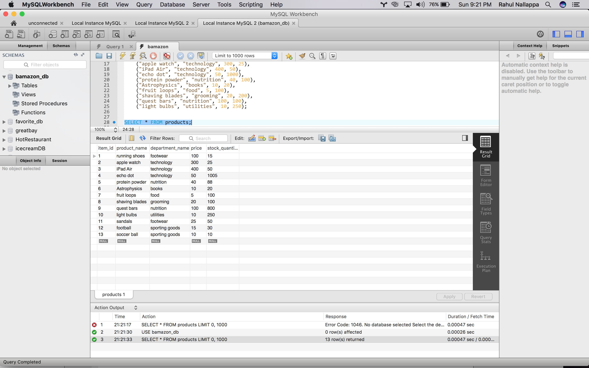

# Bamazon

Node.js & MySQL Amazon-like storefront application

# Bamazon Customer View

<!--  -->

Products are displayed upon node bamazonCustomer.js command

Asks for user input on product and quantity, then deducts quantity from chosen product in database and presents customer with final bill.

As you can see here, the quantity of the 5th product, protein powder has been deducted by 10. 

# Bamazon Manager View

Upon node bamazonManager.js command, four options are displayed for the user to choose.

The add to inventory option has been selected in this screenshot. The user simply inputs the product he wishes to restock and the quantity to add. The new quantity existing in the database is presented. 

Here, the add new product option is selected, which prompts the user to specify the name of the product, the department it belongs to, the price of the product, and the quantity of the product. 

The new product, soccer ball, has been added to the database. 